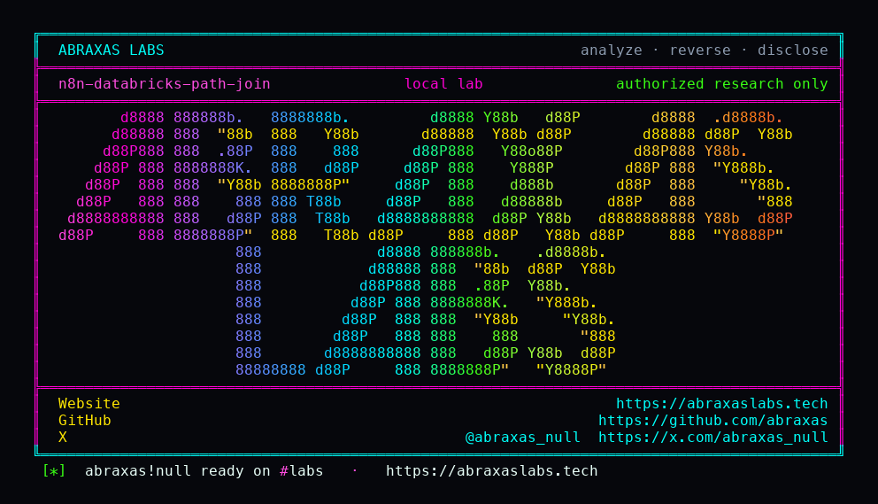

<p align="center">
  
</p>

<p align="center">
  <a href="https://abraxaslabs.tech"><strong>abraxaslabs.tech</strong></a>
  &nbsp;·&nbsp;
  <a href="https://github.com/abraxas">github.com/abraxas</a>
  &nbsp;·&nbsp;
  <a href="https://x.com/abraxas_null">@abraxas_null</a>
  &nbsp;·&nbsp;
  <a href="https://github.com/abraxas/n8n-databricks-path-join">n8n-databricks-path-join</a>
</p>

# n8n-databricks-path-join

**n8n** `2.42.0` - n8n GmbH

[GHSA-89p4-6h98-c7xm](https://github.com/n8n-io/n8n/security/advisories/GHSA-89p4-6h98-c7xm) and [GHSA-rqch-9jrh-cr8w](https://github.com/n8n-io/n8n/security/advisories/GHSA-rqch-9jrh-cr8w) introduced [`toPathSegment`](https://github.com/n8n-io/n8n/blob/n8n%402.42.0/packages/workflow/src/url.ts): `encodeURIComponent` plus reject `''` / `.` / `..`. [`getSpace.operation.ts`](https://github.com/n8n-io/n8n/blob/n8n%402.42.0/packages/nodes-base/nodes/Databricks/actions/genie/getSpace.operation.ts) concatenates `spaceId` into `${host}/api/2.0/genie/spaces/${spaceId}`. Vector Search `getIndex` and Files `downloadFile` are the same class. LangChain [`VectorStoreDatabricks`](https://github.com/n8n-io/n8n/blob/n8n%402.42.0/packages/%40n8n/nodes-langchain/nodes/vector_store/VectorStoreDatabricks/DatabricksVectorStore.ts) already wraps the index path. WHATWG `new URL` does the rest. `../` normalizes. The workflow's Databricks PAT goes with it.

**Untrusted webhook input becomes `GET /api/2.0/secrets/get` under the workspace token. Credential leak on Databricks, not n8n host RCE.**

| | |
|---|---|
| ID | no CVE yet |
| CWE | [CWE-22](https://cwe.mitre.org/data/definitions/22.html) |
| CVSS | **High: 8.6** `CVSS:3.1/AV:N/AC:L/PR:N/UI:N/S:C/C:H/I:N/A:N` |
| Product | [n8n](https://github.com/n8n-io/n8n) |
| Affected | through **2.42.0** (`86c23326`); sibling of GHSA-89p4 / GHSA-rqch |
| Auth | unauthenticated at the webhook if a victim workflow bound untrusted input |
| License | [GNU Affero GPL v3.0](LICENSE) |
| Lab | `127.0.0.1` only |

## What an attacker can do

Hit a public webhook, chat, or HTTP trigger that flows into Databricks Genie get-space (or Vector Search get-index, or Files download) with an attacker-controlled id. The workflow token then `GET`s `/api/2.0/secrets/get`. If that token may read the scope (typical workspace admin PAT), the node output is the secret `value` JSON.

Token without secrets ACL still 403s; that still proves the request left `/genie`. Files download needs a deeper `../` (longer prefix). Needs a victim who bound untrusted input into that parameter. A locked-down HTTP Request node (`allowedHttpRequestDomains: none`) is not a substitute for encoding the Databricks ids.

Same product, sibling leftover: [hidden Function vm2](https://github.com/abraxas/n8n-function-vm2).

## How I found it

Same leftover pass as the Function lab: ten hunts on **n8n@2.42.0** after the 16 September 2026 GHSA wave. The node-injection hunt was looking for incomplete siblings of GHSA-89p4 (Public API resource ids) and GHSA-rqch (Supabase table name). Elastic, Adalo, Currents, the n8n node itself. The helper exists because they already lost this fight. Databricks nodes-base does not call it.

I did not aim this at a real workspace. Lab mock on `:18203` answers `GET /api/2.0/secrets/get` with `N8N-DBX-SECRET-WITNESS`. n8n on `:18202`. Webhook `dbx-space` binds `spaceId` from JSON. Mock access log: `GET /api/2.0/secrets/get?scope=s&key=k`. Webhook body contains the witness.

Wrong turns already recorded: request staying under `/api/2.0/genie/spaces/` (then `..` was encoded - lab requires it left); treating n8n host RCE as SUCCESS; hitting a real workspace; a reverse shell. Theatre. The witness is `N8N-DBX-SECRET-WITNESS` plus the mock request line.

## Lab

```bash
cd lab
./run.sh
```

Target **only** `http://127.0.0.1:18202` (n8n) and `:18203` (mock). Credential host is the mock, not a real workspace.

```text
webhook-http=200
mock-request-line=GET /api/2.0/secrets/get?scope=s&key=k
webhook-witness=True
mock-secrets-get=True
witness=N8N-DBX-SECRET-WITNESS
SUCCESS N8N-DBX-PATH-JOIN
```

## The fix

Wrap every Databricks path id with `toPathSegment`, same as VectorStoreDatabricks.

## References

- [github.com/n8n-io/n8n](https://github.com/n8n-io/n8n) tag [n8n@2.42.0](https://github.com/n8n-io/n8n/releases/tag/n8n%402.42.0)
- [`getSpace.operation.ts`](https://github.com/n8n-io/n8n/blob/n8n%402.42.0/packages/nodes-base/nodes/Databricks/actions/genie/getSpace.operation.ts) · [`toPathSegment`](https://github.com/n8n-io/n8n/blob/n8n%402.42.0/packages/workflow/src/url.ts) · [`DatabricksVectorStore.ts`](https://github.com/n8n-io/n8n/blob/n8n%402.42.0/packages/%40n8n/nodes-langchain/nodes/vector_store/VectorStoreDatabricks/DatabricksVectorStore.ts)
- Nearby patched: [GHSA-89p4-6h98-c7xm](https://github.com/n8n-io/n8n/security/advisories/GHSA-89p4-6h98-c7xm) · [GHSA-rqch-9jrh-cr8w](https://github.com/n8n-io/n8n/security/advisories/GHSA-rqch-9jrh-cr8w)
- Same product: [n8n-function-vm2](https://github.com/abraxas/n8n-function-vm2)
- [CWE-22](https://cwe.mitre.org/data/definitions/22.html)

## License

GNU Affero GPL v3.0. See [LICENSE](LICENSE). Loopback lab only. No warranty.
